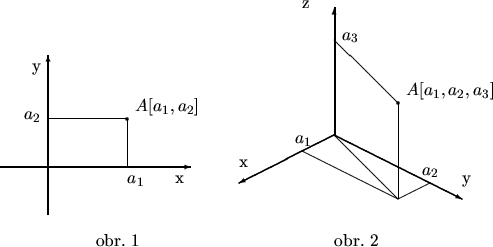
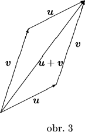
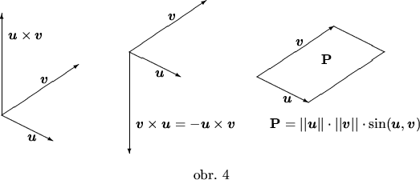
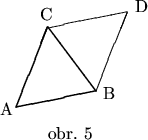
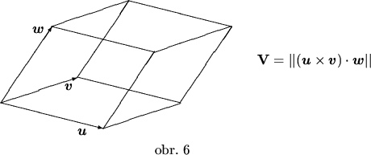

# Vektory

Vektor je geometrický objekt, ktorý je určený dĺžkou, smerom a orientáciou. Môžeme si ho predstaviť ako orientovanú úsečku, t. j. úsečku, na ktorej je vyznačený začiatočný a koncový bod. Pritom nesmieme zabudnúť, že dve rôzne orientované úsečky, ktoré majú zhodnú dĺžku (t. j. veľkosť), smer aj orientáciu, predstavujú ten istý vektor, ide o dve rôzne umiestnenia toho istého vektora.

Súradnice vektora sú súradnice jeho koncového bodu v takom umiestnení vektora, keď začiatočný bod je zhodný so začiatkom súradnicovej sústavy. Fakt, že vektor $\mathbf{v}$ má súradnice $v_{1},v_{2},v_{3}$ 2.1 budeme zapisovať $\mathbf{v}=[v_{1},v_{2},v_{3}]$. Teda, ak $A= [a_{1},a_{2},a_{3}]$ a  $B = [b_{1},b_{2},b_{3}]$, tak vektor so začiatočným bodom $A$ a koncovým bodom $B$ má súradnice $[b_{1}-a_{1},b_{2}-a_{2},b_{3}-a_{3}]$. Preto takýto vektor budeme označovať symbolom $\mathbf{B - A}$. 2.2
Polohovým vektorom bodu $A$ rozumieme vektor $\mathbf{A - O}$.
Dĺžka vektora $\mathbf{v}$ je vzdialenosť jeho začiatočného a koncového bodu a označujeme ju $\vert\vert\mathbf{v}\vert\vert$. Platí

$\vert\vert\mathbf{B - A}\vert\vert=d(A,B) = \sqrt{(a_{1}-b_{1})^2+(a_{2}-b_{2})^2+ (a_{3}-b_{3})^2}. $	(2.1)

Nulový vektor je (jediný) vektor, ktorého dĺžka je $0$. Budeme ho označovať $\mathbf{0}$. Nulový vektor má všetky súradnice rovné $0$.
Jednotkový vektor je každý vektor, ktorého dĺžka je rovná $1$. Jednotkový vektor orientovaný v kladnom smere osi $x$ označujeme $\mathbf{i}$, jednotkový vektor orientovaný v kladnom smere osi $y$ označujeme $\mathbf{j}$, jednotkový vektor orientovaný v kladnom smere osi $z$ označujeme $\mathbf{k}$. Vektory $\mathbf{i,j,k}$ tvoria bázu trojrozmerného priestoru.
V ďalšom texte predpokladajme, že $\mathbf{u}= [u_{1},u_{2},u_{3}]$ a $\mathbf{v}=[v_{1},v_{2},v_{3}]$.
Skalárny násobok vektora $\mathbf{v}$ číslom $c$ je vektor $c\cdot\mathbf{v}$, pričom:

- dĺžka vektora $c\cdot\mathbf{v}$ je $\vert c\vert$ násobkom dĺžky vektora $\mathbf{v}$
    obidva vektory majú rovnaký smer
        ak $c > 0$, tak $\mathbf{v}$ a $c\cdot\mathbf{v}$ majú zhodnú orientáciu
        ak $c < 0$, tak $\mathbf{v}$ a $c\cdot\mathbf{v}$ majú opačnú orientáciu
        ak $c = 0$, tak $c\cdot\mathbf{v} = \mathbf{0}$.

Namiesto $c\cdot\mathbf{v}$ budeme niekedy písať kratšie $c\mathbf{v}$. V súradniciach:

$ c\cdot\mathbf{v} = [cv_{1},cv_{2},cv_{3}] $

Vektor $(-1)\cdot\mathbf{v}$ voláme vektor opačný k vektoru $\mathbf{v}$ a označujeme $-\mathbf{v}$. V súradniciach:

$ -\mathbf{v} = [-v_{1},-v_{2},-v_{3}]. $

Platí: Dva nenulové vektory sú rovnobežné práve vtedy, ak jeden z nich je skalárnym násobkom druhého. Je to práve vtedy, ak podiely ich prvých, druhých aj tretích súradníc sú zhodné.

Príklad 1. Nech $A = [-3,1,7]$ a $B = [2,-5,0]$. Určte dĺžku vektora $\mathbf{B - A}$ a súradnice jednotkového vektora rovnako orientovaného v jeho smere.

Riešenie: Najskôr určíme súradnice vektora $\mathbf{B - A}$:

$ \mathbf{B - A} = [2 - (-3), -5 - 1, 0 - 7] = [5,-6,-7].$

Podľa vzťahu 2.1

$\vert\vert\mathbf{B - A}\vert\vert = \sqrt{5^2 + (-6)^2 + (-7)^2} = \sqrt{25 + 36 + 49} = \sqrt{110}.$

Označme $\mathbf{u} = [u_1,u_2,u_3]$ jednotkový vektor v smere vektora $\mathbf{B - A}$. Keďže $\mathbf{u}$ je skalárnym násobkom vektora $\mathbf{B - A}$, existuje také reálne číslo $c$, že platí

$u_1 = 5c,\quad u_2 = -6c,\quad u_3 = -7c.$

Naviac, vektor $\mathbf{u}$ má dĺžku $1$ a preto platí

$1 = \sqrt{u_1^2 + u_2^2 + u_3^2} = 25c^2 + 36c^2 + 49c^2 = 110c^2.$

Teda
$
c^2 = \frac{1}{110}.$

Posledná rovnica má práve dve riešenia $c = \pm \frac{1}{\sqrt{110}}$. Hľadaný vektor dostaneme pre hodnotu $c = \frac{1}{\sqrt{110}}$:

$ \mathbf{u} = [\frac{5}{\sqrt{110}},\frac{-6}{\sqrt{110}},\frac{-7}{\sqrt{110} }]. $

Nakoniec poznamenajme, že jednotkový vektor v smere vektora $\mathbf{B - A}$ s opačnou orientáciou dostaneme pre hodnotu $c = \frac{-1}{\sqrt{110}}$. $\clubsuit$

Príklad 2. Pre ktoré hodnoty čísel $p$ a $q$ sú vektory $\mathbf{a} = [-1,p,4]$ a $\mathbf{b} = [q,2,-3]$ rovnobežné?

Riešenie: Podľa poznámky pred predchádzajúcim príkladom sú vektory $\mathbf{a}$ a $\mathbf{b}$ rovnobežné práve vtedy, ak platí

$ \frac{-1}{q} = \frac{p}{2} = \frac{4}{-3} $

Porovnaním prvého zlomku s tretím a druhého zlomku s tretím dostávame

$ q = \frac34 \quad a \quad p = \frac{8}{-3}. $

$\clubsuit$

Súčet vektorov $\mathbf{u}$ a $\mathbf{v}$ je vektor $\mathbf{u}+\mathbf{v}$, ktorý môžeme znázorniť ako uhlopriečku v rovnobežníku so stranami tvorenými vektormi $\mathbf{u}$ a $\mathbf{v}$, pričom jeho orientácia je znázornená na obr.  1.

V súradniciach:

$ \mathbf{u}+\mathbf{v}=[u_{1} + v_{1},u_{2} + v_{2},u_{3} + v_{3}]. $

Rozdiel vektorov $\mathbf{u}$ a $\mathbf{v}$ je vektor $\mathbf{u} - \mathbf{v} = \mathbf{u} + (-\mathbf{v})$.
Ak máme dva vektory u a v, tak výraz

$ c\mathbf{u}+d\mathbf{v},\quad \mathrm{kde\ c,\ d\ sú\ ľubovoľné\ reálne\ čísla,} $

je lineárna kombinácia vektorov u a v.
Podobne, ak máme tri vektory u, v a w, tak výraz

$ c\mathbf{u}+d\mathbf{v}+e\mathbf{w},\quad \mathrm{kde\ c,\ d,\ e\ sú\ ľubovoľné\ reálne\ čísla,} $

je lineárna kombinácia vektorov u, v a w.
Čísla $c$, $d$, $e$ v lineárnej kombinácii voláme koeficienty kombinácie. Pre každú konkrétnu hodnotu koeficientov dostávame konkrétny vektor.

Platí: Ak máme dané v rovine dva nerovnobežné vektory, tak každý vektor tejto roviny sa dá jednoznačne vyjadriť v tvare lineárnej kombinácie dvoch daných vektorov. Ak máme dané v priestore tri vektory, ktoré neležia všetky v jednej rovine, tak každý vektor v priestore sa dá jednoznačne vyjadriť v tvare lineárnej kombinácie troch daných vektorov.

V dôsledku toho každý vektor sa dá napísať v tvare lineárnej kombinácie vektorov bázy:

$ \mathbf{u} = u_{1}\mathbf{i} + u_{2}\mathbf{j} + u_{3}\mathbf{k}. $

V tomto vyjadrení sú koeficienty kombinácie zhodné so súradnicami vektora, teda platí
$ \mathbf{u}=u_{1}\mathbf{i}+u_{2}\mathbf{j}+u_{3}\mathbf{k}\quad \mathrm{práve\ vtedy,\ ak} \quad \mathbf{u}=[u_{1},u_{2},u_{3}]\ . $ 	(2.2)

Príklad 3. Vyjadríme vektor [-3,1] ako lineárnu kombináciu vektorov [1,-1] a [2,3].

Riešenie: Hľadáme čísla $c$ a $d$, pre ktoré platí

$[-3,1]= c[1,-1] + d[2,3] = [c,-c] + [2d,3d] = [c + 2d,-c + 3d]\ . $

Porovnaním prvých a porovnaním druhých súradníc dostávame sústavu dvoch rovníc s dvomi neznámymi
$ c + 2d = -3 \qquad a \qquad -c + 3d = 1\ . $ 	(2.3)

Ich sčítaním sa zruší neznáma $c$ a po vydelení piatimi dostaneme hodnotu $d~=~\frac{-2}{5}$. Dosadením tejto hodnoty do prvej rovnice dostaneme aj hodnotu druhej neznámej $c = \frac{-11}{5}$. Teda platí

$[-3,1]= \frac{-11}{5}[1,-1] + \frac{-2}{5}[2,3]. $

$\clubsuit$

Príklad 4. Vyjadríme vektor $[1,2,3]$ ako lineárnu kombináciu vektorov $[1,2,-1]$, $[-2,1,0]$ a $[0,-3,1].$

Riešenie: Postupujeme podobne ako v predchádzajúcom príklade. Hľadáme také čísla $a,\ b,\ c$, aby platilo

$[1,2,3]= a[1,2,-1] + b[-2,1,0] + c[0,-3,1] = [a - 2b,2a + b - 3c,-a + c]. $

Porovnaním súradníc dostaneme pre čísla $a,\ b,\ c$ tri rovnice

$ a - 2b = 1,\qquad 2a + b - 3c = 2,\qquad -a + c = 3. $

Keď vyjadríme $b$ z prvej a $c$ z tretej rovnice pomocou $a$ a dosadíme do druhej rovnice, dostaneme rovnicu pre $a$

$ 2a + \frac{a-1}{2} - 3(a + 3) = 2 $

s riešením $a = -23$. Dosadením do prvej a tretej rovnice dostávame hodnoty $b = -12$ a $c = -20$. Preto platí

$[1,2,3]= -23[1,2,-1] - 12[-2,1,0] + -20[0,-3,1]. $

$\clubsuit$

Skalárny súčin vektorov u a v je číslo $\mathbf{u}\cdot\mathbf{v}=\vert\vert\mathbf{u}\vert\vert \vert\vert\mathbf{v}\vert\vert \cos(\mathbf{u},\mathbf{v})$. V súradniciach:
$ \mathbf{u}\cdot\mathbf{v} = u_{1} v_{1} + u_{2} v_{2} + u_{3} v_{3}. $ 	(2.4)

Z definície skalárneho súčinu a z vlastností funkcie $\cos$ vyplýva:

$\mathbf{u}\cdot\mathbf{v} > 0$ práve vtedy, ak uhol vektorov u a v je ostrý.

$\mathbf{u}\cdot\mathbf{v} = 0$ práve vtedy, ak uhol vektorov u a v je pravý.

$\mathbf{u}\cdot\mathbf{v} < 0$ práve vtedy, ak uhol vektorov u a v je tupý.

Uhol vektorov u a v, ktorých súradnice poznáme, môžeme vypočítať pomocou vzťahu

$ \cos(\mathbf{u}, \mathbf{v}) = \frac{u_{1} v_{1} + u_{2} v_{2} + u_{3} v_{3}}{\sqrt{u_{1}^2 + u_{2}^2 + u_{3}^2} \cdot \sqrt{v_{1}^2 + v_{2}^2 + v_{3}^2}} $ 	(2.5)

Príklad 5. Vypočítame uhol vektorov
 $\mathbf{u}$ a $\mathbf{v}$, ak
a) $\qquad \mathbf{u} = [-2,1] \quad a \quad \mathbf{v} = [3,4]$
b) $\qquad \mathbf{u} = [3,-2,4] \quad a \quad \mathbf{v} = [-2,-5,3]$.

Riešenie: a) Dosadením do vzťahu 2.5 dostaneme

$ cos\, \varphi = \frac{(-2).3 + 1.4}{\sqrt{(-2)^2 + 1^2}.\sqrt{3^2 + 4^2}} = \frac{-2}{5 \sqrt{5}}. $

Preto uhol $\varphi$ vektorov $\mathbf{u}$ a $\mathbf{v}$ má približnú hodnotu $100,3^{\circ}$.

b) Podobným výpočtom ako v časti a) dostaneme približné hodnoty

$ cos\, \varphi = 0,482 \qquad a \qquad \varphi = 61,2^{\circ}. $

$\clubsuit$

Príklad 6. Nájdeme jedotkový vektor kolmý na vektor $\mathbf{u} = [3,2]$.

Riešenie: Najskôr určíme niektorý vektor kolmý na vektor $\mathbf{u}$. Vo všeobecnosti, ak hľadáme niektorý vektor kolmý na vektor $[a,b]$, tak môžeme využiť vektor [-b,a], pretože ich skalárny súčin je $0$. Takže vektor $\mathbf{v} = [-2,3]$ je komý na vektor $\mathbf{u}$. Potom, spôsobom podobným ako v príklade 1 tejto kapitoly nájdeme dve riešenia úlohy

$ \mathbf{v_1} = \left[\frac{-2}{\sqrt{13}}, \frac{3}{\sqrt{13}}\right] \quad \text{and} \quad \mathbf{v_2} = \left[\frac{2}{\sqrt{13}}, \frac{-3}{\sqrt{13}}\right]
. $

$\clubsuit$

Vektorový súčin vektorov u a v je vektor $\mathbf{u}\times\mathbf{v}$, ktorý je určený nasledovne

$\vert\vert\mathbf{u}\times\mathbf{v}\vert\vert=\vert\vert\mathbf{u}\vert\vert \vert\vert\mathbf{v}\vert\vert \sin(\mathbf{u},\mathbf{v})$
jeho smer je kolmý na smery obidvoch vektorov u aj v
    orientovaný je tak, že usporiadaná trojica vektorov $[\mathbf{u},\ \mathbf{v},\ \mathbf{u}\times\mathbf{v}]$ tvorí pravotočivú sústavu vektorov

Poznamenajme, že geometrický význam prvej podmienky je ten, že dĺžka vektorového súčinu dvoch vektorov je rovná veľkosti plošného obsahu rovnobežníka vytvoreného týmito vektormi (obr. 1).

V súradniciach: 
$ \mathbf{u} \times \mathbf{v} = \begin{vmatrix}
\mathbf{i} & \mathbf{j} & \mathbf{k} \\
u_{1} & u_{2} & u_{3} \\ 
v_{1} & v_{2} & v_{3} 
\end{vmatrix}
$ 	(2.6)

Príklad 7. Vypočítame obsah trojuholníka s vrcholmi $A = [3,-1,5]$, $B = [0,4,-2]$ a
$C = [-3,3,1].$

Riešenie: Doplňme trojuholník $ABC$ na rovnobežník $ABDC$ podľa obr. 1.

Hľadaný obsah je rovný polovici plochy rovnobežníka $ABCD$, ktorá sa rovná dĺžke vektorového súčinu vektorov $\mathbf{B - A}$ a $\mathbf{C - A}$. Počítajme

$ \mathbf{(B - A)} \times \mathbf{(C - A)} = \begin{vmatrix} \mathbf{i} & \mathbf{j} & \mathbf{k} \\ 2 & 3 & 4 \\ -1 & 0 & -4 \end{vmatrix} = 8\mathbf{i} + 30\mathbf{j} + 18\mathbf{k} $

a

$ P = \frac{1}{2} \left\| \mathbf{(B - A)} \times \mathbf{(C - A)} \right\| = \frac{1}{2} \sqrt{8^2 + 30^2 + 18^2} = \frac{1}{2} \sqrt{322} \approx 17,95
 $

$\clubsuit$

Zmiešaný súčin vektorov u, v a w je súčin $(\mathbf{u}\times\mathbf{v})\cdot\mathbf{w}$. Ako vidieť z definície, zmiešaný súčin je číslo, závisiace od troch vektorov. Jeho geometrický význam je ten, že jeho absolútna hodnota je rovná veľkosti objemu rovnobežnostena vytvoreného týmito tromi vektormi umiestnenými v spoločnom začiatku (obr. 1).

V súradniciach :
$ (\mathbf{u} \times \mathbf{v}) \cdot \mathbf{w} = \begin{vmatrix}
u_{1} & u_{2} & u_{3} \\
v_{1} & v_{2} & v_{3} \\
w_{1} & w_{2} & w_{3}
\end{vmatrix}
$ 	(2.7)

Príklad 8. Vypočítame objem a obsah povrchu rovnobežnostena $ABCDA_1B_1C_1D_1$, s vrcholom $A[-1,2,-4]$ a s ním susediacimi vrcholmi $B[2,3,0]$, $D[-2,7,-4]$ a $A_1[1,-1,-6]$.

Riešenie: Objem bude rovný absolútnej hodnote zmiešaného súčinu vektorov $\mathbf{B - A} = [3,1,4]$, $\mathbf{D - A} = [-1,5,0]$ a $\mathbf{A_1 - A} = [2,-3,-2]$

$ \begin{bmatrix}
3 & 1 & 4 \\
-1 & 5 & 0 \\
2 & -3 & -2
\end{bmatrix} = -60
 $

Preto $V = \vert-60\vert = 60$. Obsah povrchu vypočítame pomocou vektorových súčinov

$ S = 2(\vert\vert\mathbf{(B - A)} \times \mathbf{(D - A)}\vert\vert + \vert\vert\mathbf{(B - A)} \times \mathbf{(A_1 - A)}\vert\vert + $

$ + \vert\vert\mathbf{(D - A)} \times \mathbf{(A_1 - A)}\vert\vert) = $

$ 2 \left( \|\mathbf{-20i} - 4\mathbf{j} + 16\mathbf{k}\| + \|10\mathbf{i} - 3\mathbf{j} - 14\mathbf{k}\| + \|-10\mathbf{i} - 2\mathbf{j} - 7\mathbf{k}\| \right) = 2 \left( \sqrt{672} + \sqrt{417} + \sqrt{153} \right) \approx 117,4. $

$\clubsuit$

Smerový vektor priamky $p$ je každý vektor rovnobežný s priamkou $p$.

Normálový vektor priamky $p$ je každý vektor kolmý na priamku $p$.

Smerový vektor roviny $\alpha$ je každý vektor rovnobežný s rovinou $\alpha$.

Normálový vektor roviny $\alpha$ je každý vektor kolmý na rovinu $\alpha$.

Poznamenajme, že ak niektorý vektor je smerovým alebo normálovým vektorom priamky alebo roviny, tak aj jeho ľubovoľný nenulový skalárny násobok je taký. To znamená, že každá priamka alebo rovina má nekonečne veľa smerových a normálových vektorov. Dôležité však je, že

- ak máme určenú priamku v rovine, tak smery jej normálového a smerového vektora sú jednoznačne určené
- ak máme určenú priamku v priestore, tak smer jej smerového vektora je jednoznačne určený, avšak má nekonečne veľa normálových vektorov rôznych smerov
- ak máme určenú rovinu v priestore, tak smer jej normálového vektora je jednoznačne určený, avšak má nekonečne veľa smerových vektorov rôznych smerov.
